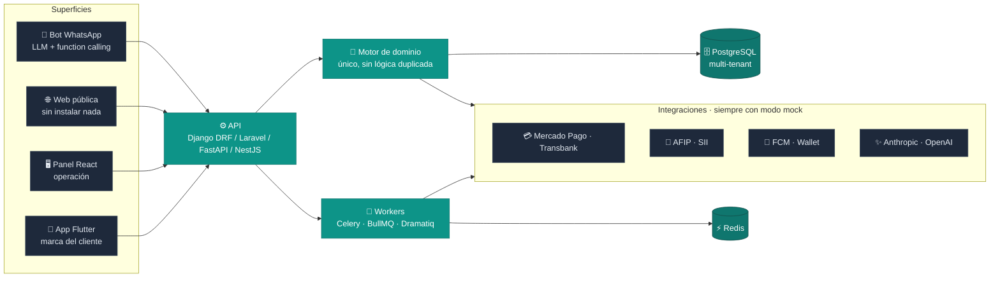

<div align="center">


**Full Stack Architect · Polyglot Backend · IA & Automatización**


<br />

[](mailto:juan@sepulveda.com.ar)
[](https://www.linkedin.com/in/juansepu96)
[](https://twitter.com/juansepu96)
[](https://softweare.com.ar)

<br />


🇦🇷 &nbsp;🇨🇱 &nbsp;🇪🇸 &nbsp;🇬🇹 &nbsp;🇵🇪

</div>

---

## 👋 Quién soy

Arquitecto de software y desarrollador **full stack polyglot**. Programo desde los **15 años** y construyo productos completos: modelo de datos, backend, panel, app móvil, landing, infra y deploy.

No me especializo en un framework — me especializo en **entregar el producto entero**. Por eso mismo tengo cuatro backends en producción (Laravel, Django, NestJS, FastAPI) y elijo el que le sirve al problema, no el que ya sé.

Hoy soy **socio fundador de [Softweare](https://softweare.com.ar)**, donde diseño y lidero productos propios y de clientes.

<table>
<tr>
<td width="33%" valign="top">

### 🏗️ Arquitectura
SaaS multi-tenant, hexagonal/DDD, microservicios, event-driven. Sistemas pensados para crecer, no para andar hoy.

</td>
<td width="33%" valign="top">

### 🤖 IA aplicada
Bots con LLM y function-calling que reservan y cotizan. Pipelines de parsing con IA de último recurso. Agentes propios.

</td>
<td width="33%" valign="top">

### 🚀 Entrega
Del `docker compose up` al store listing. VPS propio, CI/CD, apps publicadas en App Store y Google Play.

</td>
</tr>
</table>

---

## 🧩 Cómo armo un producto

La forma que se repite en casi todo lo que construyo: **una base de datos por negocio, muchas superficies encima, un solo motor de reglas**.



> **Regla que no negocio:** las integraciones externas tienen adapter con rama *mock*. El sistema entero —bot incluido— corre sin una sola credencial. Eso es lo que permite desarrollar, testear y grabar demos sin tocar producción.

---

## ⭐ Productos destacados

### 🏋️ ADM Training → **Gym OS** — la suite completa

Sistema de gestión de gimnasios que **rearquitecturé de cero a SaaS multi-gimnasio comercializable**. Cuatro superficies sobre un solo backend, **corriendo con socios reales y publicado en App Store y Google Play**.

<table>
<tr><td width="25%"><b>📱 App Flutter</b><br/><sub>iOS · Android · Web<br/>socio, profe, admin y recepción</sub></td>
<td width="25%"><b>🖥️ Panel React 19</b><br/><sub>PWA instalable<br/>operación y reportes</sub></td>
<td width="25%"><b>⚙️ API Laravel 12</b><br/><sub>multi-gimnasio<br/>con tests</sub></td>
<td width="25%"><b>🌐 Landing</b><br/><sub>captación y alta<br/>de socios</sub></td></tr>
</table>

**Lo que hace el producto**
> Turnos con cupo y open gym · **check-in por DNI** con reportes por franja horaria · facturación mensual + gastos = **rentabilidad, no solo ingresos** · multi-actividad por socio · rutinas asignables · control de peso y progreso · cobros online.

**Lo que lo hace un producto y no un CRUD**

- **Multi-gimnasio de verdad.** Cada gimnasio tiene su marca, sus planes, sus turnos y sus reportes sobre la misma base de código.
- **Login sin contraseña para el socio.** Entra con su documento y un código que le llega por WhatsApp.
- **La credencial vive en el teléfono.** Apple Wallet y Google Wallet, más QR para el ingreso.
- **Notificaciones segmentadas** que decide el administrador desde el panel.
- **Publicado de verdad**, con app en las dos tiendas y una PWA instalable como puente.

`Laravel 12` `React 19` `MUI` `Vite` `PWA` `Flutter 3` `Riverpod` `Mercado Pago` `Firebase` `Apple/Google Wallet` `Docker`

---

### 🌍 ATLAS — *Every Journey. One Place.*

Gestor de viajes que **reconstruye solo toda tu vida viajera** desde tus emails: conectás las cuentas y detecta vuelos, hoteles, Airbnb, trenes, autos, eventos y seguros.

<sub>Conecta varias casillas de correo y las lee sola · **entiende primero con reglas y recurre a la IA solo cuando hace falta**, que sale más barato y es más predecible · arma los viajes solo y evita duplicados · gastos multimoneda con conversión histórica · dashboards, mapa mundial, timeline y asistente que conoce tu propio historial.</sub>

`Python 3.13` `FastAPI` `SQLAlchemy 2 async` `Alembic` `Dramatiq` `PostgreSQL 16` `Redis` `React 19` `TypeScript` `Tailwind 4` `shadcn/ui` `Framer Motion`

---

### 💬 Softweare WhatsApp Gateway

Microservicio self-hosted que expone **toda la superficie de WhatsApp sobre HTTP**. Es la pieza que le da mensajería a todos los demás productos.

<sub>Multi-sesión · webhooks con reintentos · mensajes, media, grupos, contactos, canales y encuestas · eventos en tiempo real · sistema de plugins · dashboard React con i18n y modo oscuro · documentación interactiva. Corre en un VPS chico o escala con base y cache dedicados.</sub>

`NestJS` `TypeScript` `TypeORM` `BullMQ` `Socket.IO` `PostgreSQL / SQLite` `Redis` `Docker` `Traefik`

---

### 🛒 Ovax — ERP + CRM + tienda + app, replicado por país

Suite propia desplegada y adaptada por mercado (🇦🇷 / 🇨🇱): **mismo core, distinta fiscalidad, distinta pasarela, distinta logística**. Es el sistema donde vive la mayor densidad de integraciones que manejo.

<sub>POS con múltiples medios de pago · **facturación electrónica AFIP** 🇦🇷 y **DTE del SII** 🇨🇱 · sincronización de productos y órdenes con **MercadoLibre** y **Shopify** · cotización y tracking de envíos con **Correo Argentino, Starken, Chilexpress y BlueExpress** · stock, promociones, fidelidad, fichado de personal y notificaciones.</sub>

`Laravel 12` `React` `Flutter` `Firebase` `AFIP/ARCA` `SII/DTE` `Transbank` `Mercado Pago` `Fiserv` `Nave` `MercadoLibre` `Shopify` `Leaflet`

---

<details>
<summary><b>➕ Más proyectos con Softweare</b> — clic para desplegar</summary>

<br />

| Proyecto | Stack | Qué es |
|:---|:---|:---|
| **Prado's** | Django 5, DRF, Channels, Celery, React 18, Flutter 3 (Riverpod, go_router) | SaaS multi-tenant de turnos con agente conversacional de WhatsApp |
| **Suite MMH** (GovTech) | Laravel 11, Livewire, React, AWS S3, auditing | Digitalización documental, fiscalización electoral, registro de atenciones ciudadanas, indicadores y desarrollo social para organismos públicos |
| **Altus Abogados** | Laravel 11, Filament v3, Sanctum, React 18 + TS, i18n ES/EN, Mercado Pago | Plataforma de estudio jurídico: sitio público + backend/admin |
| **Sayhueque** | PHP, React, Vite, Flutter | E-commerce grande con catálogo extenso, intranet y app |
| **Pontebella** | React 19, Flutter, Firebase, Mercado Pago | E-commerce + ERP + app con lector de códigos de barras |
| **Plur** | Next.js 15, Prisma, Zustand, Radix UI, TipTap | CRM vertical para concierge turístico (🇪🇸) |
| **Sigobo** | PHP, AFIP | Gestión con facturación electrónica AFIP end-to-end |
| **vps-agent** | Hetzner, Docker, Caddy/nginx | Centro operativo del VPS: runbooks, health checks y deploys |
| **enerflux · todes · xte · nogoli · delta · msaconsultora · visnu · lawyers · geaCapital · blancoseguro · optalock · proyectos-inteligentes** | React 17–19, MUI / Tailwind, i18next, Vite | Landings y sitios de producto en 🇦🇷 🇬🇹 |

</details>

---

## 🛠️ Stack

<div align="center">

**Backend**


**Frontend & Mobile**


**Datos & Infra**


</div>

| Capa | Tecnologías |
|:---|:---|
| **Backend** | Laravel 11/12 · Django 5 + DRF · NestJS · FastAPI · Node/Express · PHP 8.2 · Python 3.13 |
| **Async & colas** | Celery · BullMQ · Dramatiq · Django Channels (ASGI/Daphne) · Socket.IO · WebSockets |
| **Frontend** | React 17→19 · Next.js 15 · Astro 7 · TypeScript · Vite · Tailwind 3/4 · shadcn/ui · MUI · TanStack Query · Zustand · Framer Motion |
| **Mobile** | Flutter 3 · Riverpod · BLoC · go_router · dio · Firebase Messaging · publicación en App Store y Google Play |
| **Datos** | PostgreSQL 16 · MySQL/MariaDB · Redis 7 · Supabase · Firebase · MongoDB · SQLAlchemy 2 async · Prisma · TypeORM · Alembic |
| **Infra & DevOps** | Docker / Compose · nginx · Caddy · Traefik · VPS Hetzner (~14 dominios) · GitHub Actions · S3 / MinIO / Backblaze B2 |
| **Arquitectura** | Multi-tenant · Hexagonal / DDD · Clean Architecture · Microservicios · Event-driven · REST versionada + OpenAPI |
| **Calidad** | PHPStan / Larastan · Pint · Pest · pytest · Vitest · ESLint · Prettier |

---

## 🤖 IA y automatización

- **Bots con LLM y function-calling** que atienden, cotizan y reservan sobre WhatsApp — con agente determinístico espejo para poder testear sin gastar tokens.
- **Router multi-modelo propio** (Anthropic / OpenAI / Groq / Gemini / OpenRouter / locales) con caché, manejo de contexto y fallback entre proveedores.
- **Parsing híbrido determinista → IA**: primero parsers y reglas, la IA solo donde falla. Más barato, más predecible y auditable.
- **Prospección automatizada** con enriquecimiento de datos y outreach multicanal.
- **Voz y telefonía**: bots de llamadas con Twilio y procesamiento de lenguaje natural.
- **Automatización de mi propio pipeline**: skills de Claude Code que hice para builds en CI, firma y subida a las stores, capturas y fichas de tienda, push notifications end-to-end, Apple/Google Wallet y generación de material de marca.

---

## 🌎 Alcance internacional

| | País | Qué resolví ahí |
|:---:|:---|:---|
| 🇦🇷 | **Argentina** | E-commerce, facturación electrónica AFIP, ERPs, sistemas gubernamentales y SaaS propios |
| 🇨🇱 | **Chile** | Pasarela Transbank, SII, contabilidad local, CRMs e integraciones de logística |
| 🇪🇸 | **España** | Productos digitales, CRMs verticales, dashboards y landings |
| 🇬🇹 | **Guatemala** | Digitalización, sistemas de gestión y apps móviles |
| 🇵🇪 | **Perú** | Soluciones empresariales e integraciones |

<sub>Conozco las regulaciones, las pasarelas y el contexto de negocio de cada mercado — no solo el idioma.</sub>

---

## 🔌 Integraciones que ya tengo resueltas

Esto es, para mí, la diferencia entre un demo y un sistema que factura. **Más de 45 integraciones en producción**, todas con la misma disciplina: modo de prueba sin credenciales, tests propios y degradación explícita cuando el proveedor se cae.

<table>
<tr><th align="left" width="22%">💳 Pagos</th><td>

**Mercado Pago** (preferencias, Payments API, webhooks firmados) · **Transbank** Webpay 🇨🇱 · **Fiserv** · **Nave** (Naranja X, sandbox + producción, POS ID) · checkout propio con conciliación

</td></tr>
<tr><th align="left">🧾 Fiscal y regulatorio</th><td>

**AFIP / ARCA** 🇦🇷 — facturación electrónica A y B, punto de venta, condición de IVA · **SII Chile** — emisión de **DTE**, folios y consulta de RUT · reportería regulatoria para el sector seguros

</td></tr>
<tr><th align="left">📦 Logística y envíos</th><td>

**Correo Argentino** (cotización de envíos + tracking) · **Andreani** · **Starken** 🇨🇱 · **Chilexpress** · **BlueExpress** · motor propio de métodos de envío con reglas por zona y peso

</td></tr>
<tr><th align="left">🛒 Marketplaces</th><td>

**MercadoLibre** — OAuth, sincronización de productos y órdenes, respuesta automática de preguntas, grillas de talles y **generación de payload asistida por IA** · **Shopify** — app OAuth, sync de catálogo y webhooks

</td></tr>
<tr><th align="left">💬 Mensajería</th><td>

**Gateway propio de WhatsApp** (NestJS, multi-sesión) · **whatsapp-web.js** · **Green API** · **Twilio** (voz y SMS) · **Firebase Cloud Messaging** · **Web Push** · **Pusher** · SMTP y campañas transaccionales

</td></tr>
<tr><th align="left">🤖 IA y LLM</th><td>

**Anthropic** · **OpenAI** · **Groq** · **Gemini** · **OpenRouter** · router multi-proveedor propio con caché y fallback · **function calling** para que el bot reserve y cotice · RAG y embeddings · **ElevenLabs** (voz)

</td></tr>
<tr><th align="left">🎟️ Wallet y credenciales</th><td>

**Apple Wallet** — generación y firma de pases · **Google Wallet** · credenciales con QR de vigencia limitada · escaneo desde la app

</td></tr>
<tr><th align="left">📈 Ventas y CRM</th><td>

**LinkedIn** (automatización de prospección) · **HeyReach** · **Apollo.io** · **Instantly** · **Unipile** · webhooks de leads hacia CRM

</td></tr>
<tr><th align="left">🔐 Identidad</th><td>

**OAuth 2.0** con Google, Microsoft y Atlassian · autenticación por **JWT** · Sanctum · **códigos de un solo uso por WhatsApp** · cifrado de credenciales guardadas · reCAPTCHA

</td></tr>
<tr><th align="left">☁️ Cloud e infra</th><td>

**AWS** (S3, EC2) · **Hetzner Cloud API** · **Cloudflare** (API, DNS, **R2**) · **Backblaze B2** · **MinIO** · **Supabase** · **Firebase** · CloudPanel · Ferozo

</td></tr>
<tr><th align="left">🗺️ Mapas y datos</th><td>

**Google Maps API** · **Leaflet** · mapas estáticos · **IMAP** multi-proveedor (Gmail, Outlook, Yahoo, iCloud) con sync incremental · **Puppeteer** para scraping y render

</td></tr>
<tr><th align="left">📄 Documentos</th><td>

PHPSpreadsheet · DomPDF · jsPDF · html2canvas · xlsx · generación de PDF con firma y logos por tenant · exportaciones masivas

</td></tr>
</table>

---

## 🧭 Cómo trabajo

```text
Arquitectura primero  →  MVP rápido  →  ciclos cortos  →  producción
```

- **Decido y documento el porqué.** Cada proyecto mío tiene su `DECISIONS.md`: qué parece un bug y no lo es, qué se descartó y por qué.
- **Un solo motor de reglas.** Si la lógica de negocio está en dos lados, está mal. App, web, panel y bot llaman al mismo código.
- **Todo corre en local con un comando.** `docker compose up` como requisito duro, integraciones en modo mock, seed con datos demo reales.
- **Código mantenible.** PHPStan, Pint, Pest, pytest, ESLint. Tests donde aportan, no para el coverage.
- **Comunicación sin sorpresas.** Updates frecuentes, alcance explícito, lo que no entra se dice antes.
- **Autonomía full stack.** Del modelo de datos al deploy y al store listing, sin depender de terceros para decisiones técnicas.

---

## 📊 Los números

> Los contadores públicos de GitHub me dan **cero**: casi todo mi trabajo es de clientes y vive en repos privados. Así que acá van los de verdad, contados sobre los **89 repositorios de mi cuenta**.

<div align="center">

| | | | |
|:---:|:---:|:---:|:---:|
| **89** | **2.073** | **28** | **9** |
| repositorios | contribuciones<br/>últimos 12 meses | repos dockerizados | apps Flutter<br/>iOS + Android |

</div>

**Lenguaje principal por repositorio** — 87 repos con código:

```text
JavaScript   ██████████████████████████████  30
TypeScript   ████████████████████            20
PHP          ███████████████                 15
Dart         ███████                          7
Python       ██████                           6
Blade        ████                             4
Astro        █                                1
```

<sub>PHP y JavaScript pesan más en bytes (52 % y 33 % de 159 MB), pero el reparto por repo es el que muestra cómo trabajo hoy: TypeScript y Python creciendo, PHP sosteniendo los ERPs que ya facturan.</sub>

**Y lo que no se cuenta en commits:**

| | |
|:---|:---|
| 🏬 **~14 dominios** en producción sobre un VPS que administro yo | 📱 Apps publicadas en **App Store y Google Play** |
| 🌎 Clientes en **5 países** | 🏛️ Sistemas corriendo en **organismos públicos** |

---

<div align="center">

## 💼 ¿Armamos algo?

Si necesitás a alguien que **diseñe la arquitectura, lidere el equipo y lo deje andando en producción** — no solo que escriba código — escribime.

[](mailto:juan@sepulveda.com.ar)
[](https://www.linkedin.com/in/juansepu96)
[](https://twitter.com/juansepu96)

<br />

<sub>Full Stack Architect · Polyglot Backend · IA & Automatización · 🇦🇷 🇨🇱 🇪🇸 🇬🇹 🇵🇪</sub>

</div>
